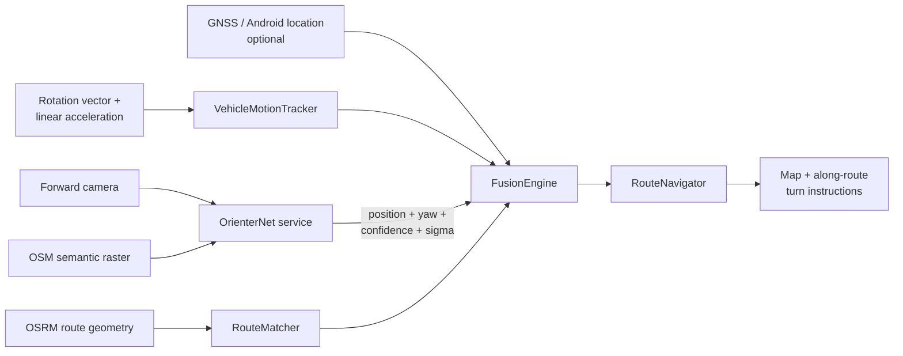

# OrienterNav

OrienterNav is an Android car navigator designed to keep a usable position estimate when GNSS is degraded, jammed, absent or spoofed. GNSS is treated as one optional observation rather than the navigation state itself.

The v0.2 pipeline combines:

- OpenStreetMap route geometry;
- heading-aware route map matching;
- smartphone IMU short-horizon dead reckoning;
- forward-camera visual localization through OrienterNet;
- uncertainty-aware multi-source fusion;
- GNSS integrity checks instead of blind trust in Android location fixes.

> This is an experimental navigation/integrity project, not a certified automotive positioning system. Consumer phone IMUs drift and visual localization can fail. The software therefore exposes uncertainty and deliberately refuses to invent an absolute coordinate when no trustworthy anchor exists.

## What changed in v0.2

### GNSS is no longer the state

`FusionEngine` maintains an independent motion state. A trustworthy GNSS fix may calibrate it, but a visual fix can also become the absolute anchor. Once anchored, IMU motion propagates the car between absolute fixes. When GNSS disagrees with that independent trajectory it becomes **suspected**, but IMU alone is not allowed to confirm spoofing. A stable visual cluster is still required before GNSS is fully rejected.

### Route map matching

The old navigator used the nearest route vertex and straight-line distance to maneuver points. That behaves badly on curved roads, interchanges and parallel carriageways.

v0.2 adds `RouteMatcher` and `RouteNavigator`:

- projection onto route **segments**, not vertices;
- continuous progress in metres along the route polyline;
- heading penalty to separate parallel/opposite roads;
- monotonic-progress hysteresis to prevent jumping backwards;
- cross-track error and off-route warning;
- turn distance measured **along the route**, not through buildings/blocks;
- route constraints applied to inertial propagation only while heading and geometry remain plausible.

### Smartphone IMU dead reckoning

`VehicleMotionTracker` uses Android rotation-vector and linear-acceleration sensors. A trusted course calibrates the phone-to-vehicle heading offset. The tracker emits incremental distance, velocity, heading and an uncertainty that grows with time and distance since the last correction.

The design is intentionally conservative: IMU propagation is for seconds/tens of seconds between visual/absolute fixes, not indefinite standalone INS.

### Better visual confidence

The OrienterNet service previously converted only spatial RMS into confidence and accepted the model argmax even when the posterior was broad or ambiguous. v0.2 additionally evaluates posterior entropy and softly checks yaw against an independent heading prior. Broad/multimodal fixes are down-weighted before reaching the Android fusion logic.

### Faster recovery

Visual localization is requested more frequently when the system is in `GPS_SUSPECTED`, `SPOOF_CONFIRMED`, `VISUAL_ONLY` or degraded mode. When the solution is healthy the rate is reduced to avoid unnecessary GPU load.

## Runtime architecture



More detail: [docs/ARCHITECTURE.md](docs/ARCHITECTURE.md) and [docs/GNSS_DENIED.md](docs/GNSS_DENIED.md).

## Positioning modes

| Situation | Output |
|---|---|
| GNSS healthy, no visual check yet | GNSS with reported uncertainty |
| GNSS + vision agree | uncertainty-weighted fused position, optionally route-snapped |
| GNSS disagrees with IMU | `GPS_SUSPECTED`; GNSS is not rejected yet |
| repeated vision disagrees with GNSS | `SPOOF_CONFIRMED`; use visual/inertial state |
| GNSS unavailable, recent visual anchor exists | visual + IMU + optional route constraint |
| no GNSS, no visual/manual absolute anchor | no fabricated absolute position; state remains waiting/degraded |

## GPS-free operation

GNSS is not required after a trustworthy absolute anchor exists. There are three practical starts:

1. enter the departure point/address manually and build the route;
2. use an earlier trusted GNSS fix only as the initial anchor, then continue without it;
3. use visual localization around a known/manual prior.

A phone camera cannot infer an arbitrary city from one road image with the current local OrienterNet backend. Its search is prior-conditioned. A completely cold start with no GNSS, no manually supplied area and no global visual database is therefore intentionally unsupported rather than guessed.

## Implemented navigator features

- MapLibre map with OpenFreeMap OSM style, no Google Maps API key;
- Nominatim address search;
- destination by map tap;
- OSRM driving route and full polyline;
- Russian turn instructions and TTS;
- route-progress tracking and cross-track error;
- CameraX forward capture with adaptive rate;
- authenticated OrienterNet API and OSM raster cache;
- lazy GPU model loading and Docker deployment;
- GNSS/vision/IMU integrity state machine;
- unit tests for fusion, spoof handling and map matching;
- GitHub Actions APK build and service contract tests.

## Build the APK on Windows

### GitHub Actions

1. Open **Actions** in this repository.
2. Select the latest successful **CI** run.
3. Download artifact `OrienterNav-debug-apk`.
4. Unpack it and install `app-debug.apk` on Android 8.0+.

### Local build

Install Android Studio with Android SDK 35 and JDK 17, then:

```bat
gradlew.bat testDebugUnitTest assembleDebug
```

APK output:

```text
app\build\outputs\apk\debug\app-debug.apk
```

## Start visual localization

The original OrienterNet evaluation is a PyTorch/GPU workload and is not embedded into the APK. Run the included service on a Linux/NVIDIA host:

```bash
cd orienternet-service
cp .env.example .env
# change ORIENTERNET_API_KEY in .env
docker compose up --build -d
curl -H "X-API-Key: YOUR_KEY" -X POST http://127.0.0.1:8000/v1/warmup
```

Expose it through HTTPS (for example through a private reverse proxy/tunnel), then enter the URL and API key in the app settings. Android blocks generic clear-text LAN transport because camera frames and the key should not be sent unencrypted.

API-only mock test:

```bash
cd orienternet-service
python -m venv .venv
. .venv/bin/activate
pip install -r requirements.txt
ORIENTERNET_MOCK=1 ORIENTERNET_API_KEY=test uvicorn app.main:app --port 8000
pytest -q
```

## Recommended hardware / next accuracy step

The current phone-only stack is deliberately deployable without modifying the vehicle. For substantially better long-duration GNSS-denied accuracy, the next source should be **wheel speed / odometry** from OBD-II/CAN (read-only), not more aggressive accelerometer integration. Wheel distance plus phone gyro plus visual/map corrections is much more observable than integrating consumer accelerometer bias for minutes.

Other high-value extensions are documented in [docs/GNSS_DENIED.md](docs/GNSS_DENIED.md): lane/road-edge visual constraints, barometer/elevation matching, Wi-Fi/cellular signals of opportunity, local visual place recognition, HMM/particle-filter road hypotheses and offline routing/maps.

## Network/offline note

The positioning logic can operate without GNSS, but the default map/search/router endpoints are online public services. For operation with no external connectivity, self-host or package equivalents for:

- map tiles/style;
- OSRM routing graph;
- Nominatim/geocoding;
- OrienterNet raster/map data.

The public OSRM/Nominatim endpoints are suitable for testing, not production traffic.

## Limitations

- consumer IMU bias causes dead-reckoning drift;
- phone mounting orientation must remain stable after calibration;
- magnetic/rotation-vector heading may degrade inside some vehicles;
- visual localization may fail at night, in snow/rain, on featureless/repetitive roads or with stale OSM data;
- route snapping is disabled when cross-track/heading consistency is poor, so an incorrect route is not allowed to silently drag the car onto the wrong road;
- this project detects coordinate inconsistency; it is not an RF jammer detector and cannot identify every sophisticated spoofing attack.

OrienterNet code/pretrained weights have their own non-commercial licensing constraints. See [THIRD_PARTY_NOTICES.md](THIRD_PARTY_NOTICES.md).
