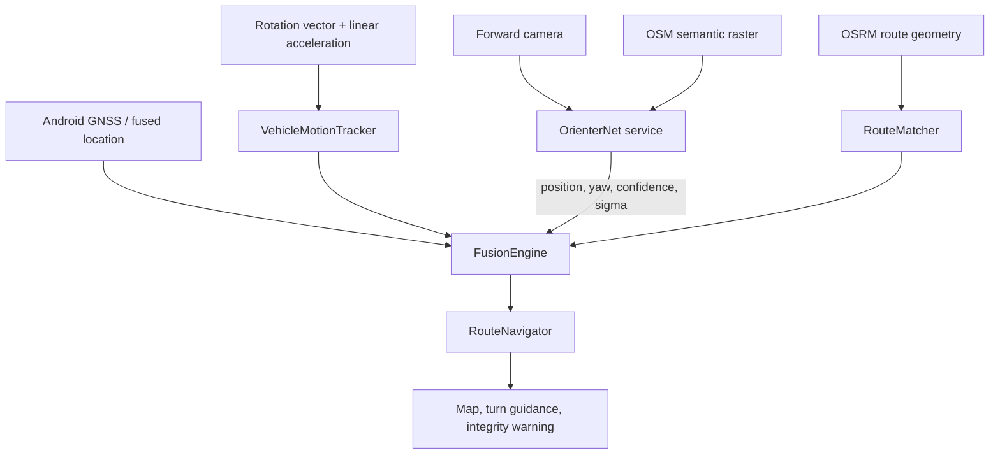

# Architecture and trust model

## Runtime path

GNSS is an observation channel, not the authoritative state. The independent state can be anchored by vision and then propagated by IMU. The route is a soft geometric constraint, never an unconditional snap target.

## Source roles

### GNSS / Android location

Useful when healthy because it supplies absolute position, speed and course cheaply. It is never considered sufficient evidence that it is correct simply because Android reports small `accuracy`.

### Visual localization

Provides an absolute position/yaw estimate against OSM around a prior. It is the independent absolute source used to confirm or reject GNSS disagreement. The server reports confidence and spatial sigma derived from the posterior.

### Phone IMU

Provides continuity between absolute fixes. It is deliberately short-horizon. Bias is not hidden: uncertainty grows with time/distance and the system stops treating the result as precise.

### Route geometry

Provides a road-bearing and cross-track constraint. A propagated point may be projected onto the selected route only when the raw point is close enough and the route heading is compatible with the inertial heading. This prevents a stale/wrong route from silently dragging the estimate across an intersection.

## Decision rules

1. A single visual estimate never proves spoofing.
2. Low-confidence or very broad visual posteriors are discarded/down-weighted.
3. Several visual estimates must be mutually consistent in motion and yaw.
4. GNSS-vs-IMU innovation can mark GNSS as `GPS_SUSPECTED`, but cannot by itself produce `SPOOF_CONFIRMED`.
5. Repeated consistent vision that disagrees with GNSS beyond the dynamic uncertainty threshold can confirm spoofing.
6. Once GNSS is rejected, the output comes from the visual anchor propagated by IMU and optionally constrained by route geometry.
7. When no fresh absolute anchor exists, the system refuses to invent a global coordinate.

## Route matching

`RouteMatcher` works on polyline segments and stores cumulative distance. Candidate score combines:

- cross-track distance;
- heading disagreement penalty;
- backwards-progress rejection/hysteresis.

`RouteNavigator` keeps route progress monotonic and measures the distance to the next maneuver along the route polyline. This replaces the old straight-line distance to maneuver coordinates, which was especially wrong on curved roads, ramps and block-shaped city routes.

## Visual prior

OrienterNet is a local prior-conditioned localizer. Under healthy positioning, the current fused point is used as the search prior. During degraded/spoofed operation, the prior follows independent route/IMU progress rather than suspicious GNSS.

Search radius is increased in degraded states and visual capture frequency is also increased until the estimator recovers.

## Fundamental observability limits

No software-only phone solution can provide unlimited high-accuracy inertial navigation. Consumer MEMS acceleration bias integrates into velocity and then position error. A route constraint removes part of the cross-track drift but does not make longitudinal distance observable on a long straight road.

Likewise, a local visual map matcher cannot determine an arbitrary country/city from one image without a global visual database or another coarse prior. For a cold GNSS-free start the user therefore supplies the start/area manually, or the application reuses an earlier trustworthy anchor.

## Threat model

The project targets:

- complete GNSS loss/jamming;
- gross coordinate spoofing;
- multipath and implausible GNSS jumps;
- short/medium gaps between absolute position corrections.

It does not claim protection against every sophisticated coordinated attack. An attacker capable of simultaneously controlling GNSS, camera imagery/map semantics, route data and device sensors can defeat this architecture. The project is not a certified safety instrument.

See [GNSS_DENIED.md](GNSS_DENIED.md) for the accuracy roadmap and field-test procedure.
