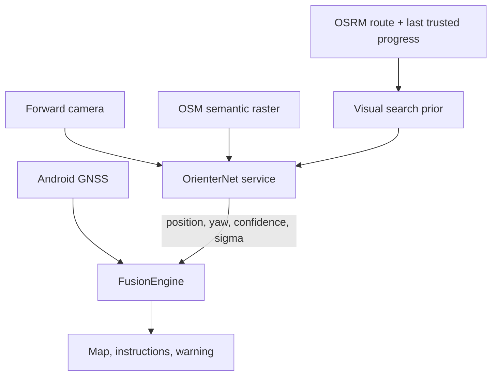

# Architecture and trust model

## Runtime path

The normal navigator does not depend on OrienterNet: MapLibre renders OSM data,
Nominatim resolves user-entered addresses, and OSRM provides a driving route.
Visual localization is an additional integrity channel.

## Decision rules

- A single visual estimate never replaces GNSS.
- Estimates below `0.38` confidence or above `45 m` sigma are discarded.
- Three recent visual estimates must agree within `28 m`.
- GPS is rejected only when that cluster also disagrees with GNSS beyond a
  dynamic threshold derived from GPS accuracy and visual uncertainty.
- When both channels agree, they are uncertainty-weighted; visual influence is
  capped so an overconfident frame cannot cause a large jump.
- During a suspected spoof, the visual search center is predicted from the last
  trusted route position, elapsed time, and the last plausible speed. It is not
  taken blindly from the suspicious GPS coordinate.

## Fundamental limit

OrienterNet is a local, prior-conditioned localizer, not a planet-wide image
search engine. The included server searches at most 256 m around a prior. If the
application starts while GPS is already displaced by kilometers and there is no
manual start or earlier trusted route state, the system cannot infer the city
from one image. This is why a manual origin and route-constrained prior are
first-class inputs.

## Threat model

The system is intended to detect ordinary GNSS loss, gross multipath errors and
coordinate spoofing. It is not a certified safety or anti-jamming instrument.
It can fail with stale/incorrect OSM data, featureless roads, darkness, adverse
weather, blocked camera view, repeated urban geometry, or adversarial signs and
images. The driver remains responsible for safe operation.
