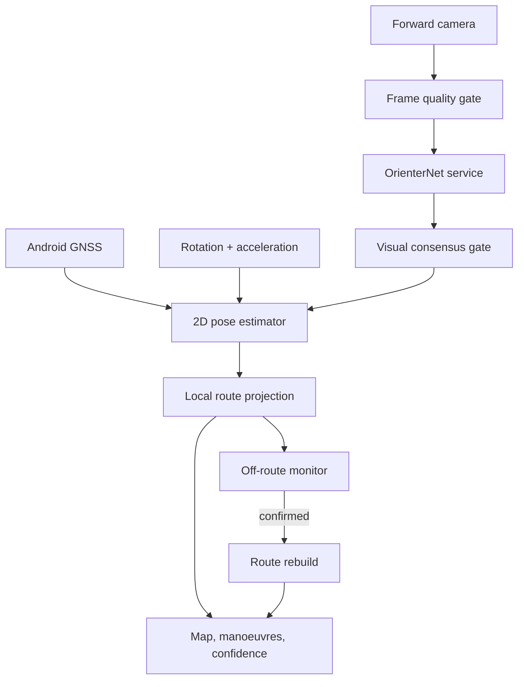

# Architecture and trust model

## Runtime path

## Pose state

The active Android application keeps a real two-dimensional position, speed,
heading and uncertainty. The route is not the position model. IMU prediction
can therefore follow a real turn away from the original route.

- trusted GNSS softly corrects position, speed and bearing;
- the rotation vector updates heading;
- linear acceleration is transformed from device axes into the Earth frame
  when an absolute rotation vector is available;
- the predicted point advances in the current vehicle heading;
- uncertainty grows while no absolute GPS or visual fix is available;
- a physically impossible short-interval GPS jump is rejected;
- visual recovery needs two consistent frames, or three frames for a large
  correction.

## Off-route and rerouting

Rerouting is debounced. A single noisy location cannot trigger it. The monitor
requires a reliable recent absolute fix, sufficient distance from the route,
and repeated evidence of a heading mismatch or increasing cross-track error.
After confirmation OSRM is queried from the fused two-dimensional position to
the unchanged destination. A cooldown prevents request loops.

## Display smoothing

The map marker receives the continuously predicted state rather than raw GPS
or raw OrienterNet coordinates. Absolute measurements are blended into the
state, while MapLibre camera movement is animated at a lower frequency. This
separates navigation truth from display animation and removes most visible
jumps.

## Camera failure handling

JPEG frames are evaluated on the phone before upload. Strong overexposure,
underexposure and low-detail/blurred frames are skipped. Exposure compensation
is nudged when supported. While frames are unusable, the 2D estimator continues
from speed, acceleration and heading and reports increasing uncertainty.

## Fundamental limits

Phone IMU is a short-gap aid, not an indefinitely accurate standalone INS.
Accelerometer bias and imperfect mounting cause drift. The phone must be fixed
rigidly in the vehicle, and GPS or visual corrections must periodically return.

OrienterNet is a prior-conditioned localizer. The service searches at most 256
metres around one prior. A future multi-chunk server endpoint can search several
road hypotheses when the covariance grows beyond one tile.
